# Sortify Design System v1.1 — 코드 이관 영향도 / 구조도

> 목적: Figma에서 확정한 v1.1 디자인시스템을 실제 코드에 옮기면 **무엇이, 어디에서, 어떻게 바뀌는지**를 구현 기준으로 설명한다.  
> 상태: **설계 완료 / Production 이관 전**  
> 선행 조건: `migration-readiness.md`의 G0 — Together 브랜치 기준선 통합

---

# 1. 한 문장으로 보면 무엇이 바뀌는가

현재 Sortify는 화면별로 직접 가진 UI가 많고, 일부 공통 UI는 `SpaceUI.tsx`에 모여 있다.

v1.1 이관 후에는:

> **페이지는 데이터·상태·라우팅·DB 로직을 맡고,  
> 공용 UI는 Design System, 음악/소트 고유 UI는 Product Component가 맡는다.**

즉 화면을 새로 만드는 것이 아니라, **현재 페이지 안에 흩어진 UI 표현을 공통 컴포넌트로 바꾸는 작업**이다.

---

# 2. 전체 구조 변화

## 2.1 현재 구조

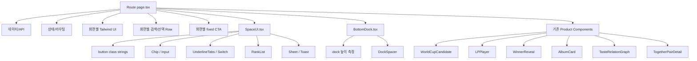

문제는 `SpaceUI.tsx`가 어느 정도 공용화를 했음에도, **화면이 커질수록 화면 내부 Tailwind 조합이 다시 늘어난다**는 점이다.

예:

- `/explore`의 검색 입력·아티스트 Row
- `/tracks`의 검색 입력·곡 선택 Row·하단 상태
- `/together/new`의 같은 역할 UI 재구현
- `/worldcup`의 Progress / Hint / Undo
- My Space / Archive의 비슷한 목록 Row
- Invite / Together Result의 같은 Hero fade

---

## 2.2 목표 구조

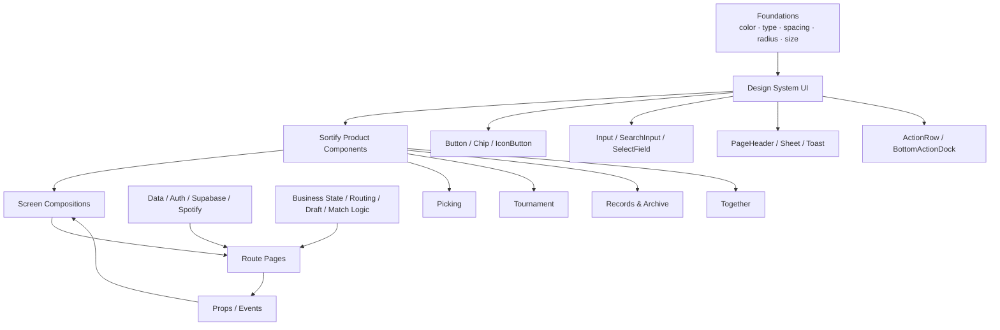

핵심 경계:

| 계층 | 책임 |
|---|---|
| Foundations | 색·폰트·spacing·radius·size의 의미 |
| Design System UI | 음악 도메인을 몰라도 되는 공용 UI |
| Product Component | Sortify의 소트·음악·관계 경험 |
| Composition | 특정 화면에서 컴포넌트를 조합하는 규칙 |
| Route Page | 데이터, 상태, 라우팅, 인증, DB, API |

---

# 3. 권장 코드 폴더 구조

현재 저장소에는 정식 `src/components/ui` 계층이 없다.  
v1.1 이관 시 아래처럼 **UI / Product를 분리**하는 것을 권장한다.

```text
src/
├─ app/
│  ├─ explore/page.tsx
│  ├─ tracks/page.tsx
│  ├─ worldcup/page.tsx
│  ├─ explore-taste/page.tsx
│  ├─ archive/page.tsx
│  ├─ taste/[id]/page.tsx
│  └─ together/...
│
├─ components/
│  ├─ ui/
│  │  ├─ Button.tsx
│  │  ├─ Chip.tsx
│  │  ├─ IconButton.tsx
│  │  ├─ Input.tsx
│  │  ├─ SearchInput.tsx
│  │  ├─ SelectField.tsx
│  │  ├─ PageHeader.tsx
│  │  ├─ Sheet.tsx
│  │  ├─ Toast.tsx
│  │  ├─ ActionRow.tsx
│  │  └─ BottomActionDock.tsx
│  │
│  ├─ picking/
│  │  ├─ ArtistGridItem.tsx
│  │  ├─ SelectableArtistRow.tsx
│  │  ├─ SelectableTrackRow.tsx
│  │  └─ AlbumSelectionHeader.tsx
│  │
│  ├─ tournament/
│  │  ├─ TournamentProgress.tsx
│  │  ├─ GestureHint.tsx
│  │  └─ UndoNotice.tsx
│  │
│  ├─ records/
│  │  ├─ RecordRow.tsx
│  │  ├─ WinnerFeature.tsx
│  │  └─ UnreleasedTrackItem.tsx
│  │
│  ├─ together/
│  │  ├─ CodeInput.tsx
│  │  ├─ RoomCodeCard.tsx
│  │  ├─ ParticipantChip.tsx
│  │  ├─ MediaHero.tsx
│  │  ├─ MatchMetric.tsx
│  │  ├─ TasteRelationGraph.tsx
│  │  ├─ ParticipantSheet.tsx
│  │  └─ TogetherPairDetail.tsx
│  │
│  ├─ album/
│  │  └─ AlbumCard.tsx
│  │
│  ├─ result/
│  │  └─ WinnerReveal.tsx
│  │
│  ├─ WorldCupCandidate.tsx
│  └─ LPPlayer.tsx
│
└─ app/globals.css
```

### 중요한 점

처음 이관할 때 기존 파일을 대규모로 이동하지 않는다.

특히:

- `WorldCupCandidate.tsx`
- `LPPlayer.tsx`
- `WinnerReveal.tsx`
- `AlbumCard.tsx`

는 **파일 위치까지 동시에 바꾸지 않는다.**

디자인시스템 이관과 파일 재배치를 한 PR에 섞으면 diff가 지나치게 커지고 회귀 원인 추적이 어려워진다.

---

# 4. SpaceUI.tsx는 어떻게 바뀌는가

현재 `src/components/space/SpaceUI.tsx`에는 아래가 한 파일에 함께 있다.

- `primaryButton`
- `secondaryButton`
- `dangerButton`
- `Chip`
- `Input`
- `UnderlineTabs`
- `SectionTitle`
- `EmptyState`
- `Cover`
- `Avatar`
- `Switch`
- `RankList`
- `Sheet`
- `ConfirmSheet`
- `Toast`
- `useToast`

v1.1에서는 역할별로 분리한다.

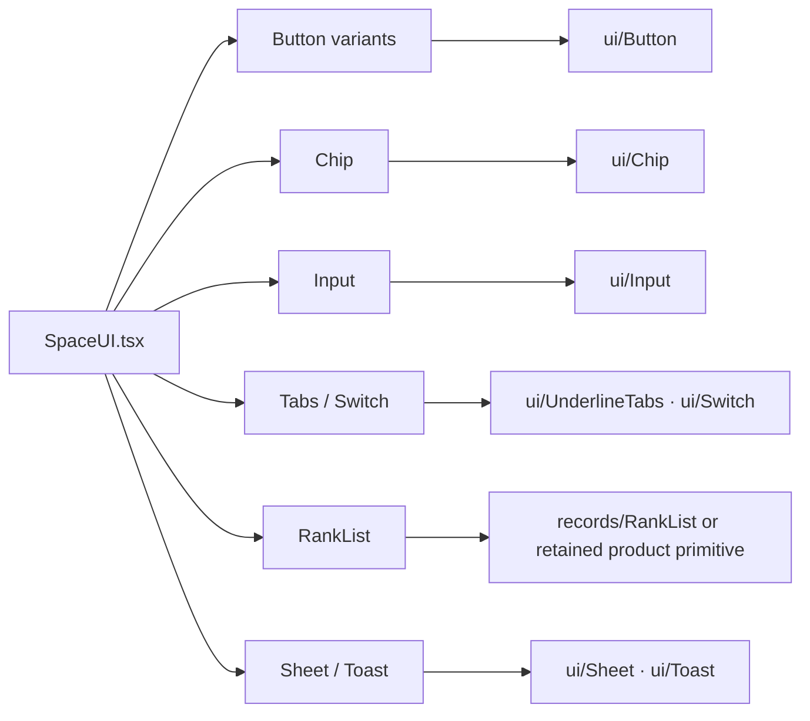

## 이관 방식

처음부터 `SpaceUI.tsx`를 삭제하지 않는다.

과도기에는 **re-export compatibility layer**로 남긴다.

```tsx
// SpaceUI.tsx — migration compatibility
export { Button } from "@/components/ui/Button";
export { Chip } from "@/components/ui/Chip";
export { Input } from "@/components/ui/Input";
export { Sheet, ConfirmSheet } from "@/components/ui/Sheet";
export { Toast, useToast } from "@/components/ui/Toast";
```

그 후 소비처를 하나씩 새 import로 옮기고, 마지막 사용처가 사라진 뒤에만 compatibility export를 제거한다.

---

# 5. 화면별로 무엇이 어떻게 바뀌는가

## 5.1 최애곡 소트 — 아티스트 선택 `/explore`

### 현재

페이지 안에 직접 존재:

- 검색 입력 스타일
- 검색 결과 아티스트 Row
- 추천 아티스트 카드
- 선택 border/color
- 다음 CTA
- 로딩 표현

현재 선택 상태는 일부 위치에서 `point` border를 사용한다.

### 이관 후

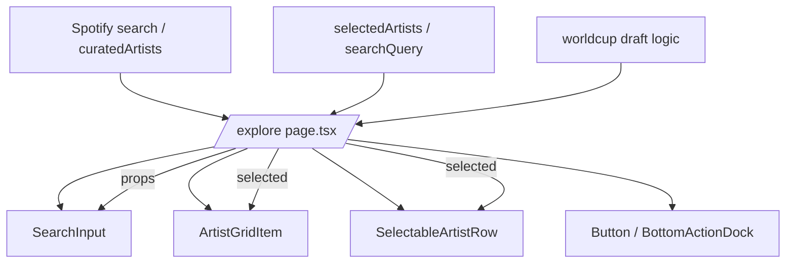

### 페이지에서 빠지는 것

- 반복되는 `rounded / border / background / focus` class 조합
- 아티스트 선택 시 visual branch
- 검색창 clear/loading 아이콘 배치 규칙

### 페이지에 남는 것

- Spotify 검색
- curated artist 데이터
- selectedArtists state
- single/mix mode 판단
- draft 저장
- 다음 route 결정

---

# 6. `/tracks`는 어떻게 바뀌는가

## 현재

이미 `AlbumCard`는 공용화돼 있지만 주변 선택 UI는 페이지가 직접 가진다.

- 검색 입력
- 앨범 전체 선택/해제
- 곡 Row
- 곡별 선택 pill
- 선택 곡 수
- 최소 선택 곡 안내
- 하단 시작 CTA

## 이관 후

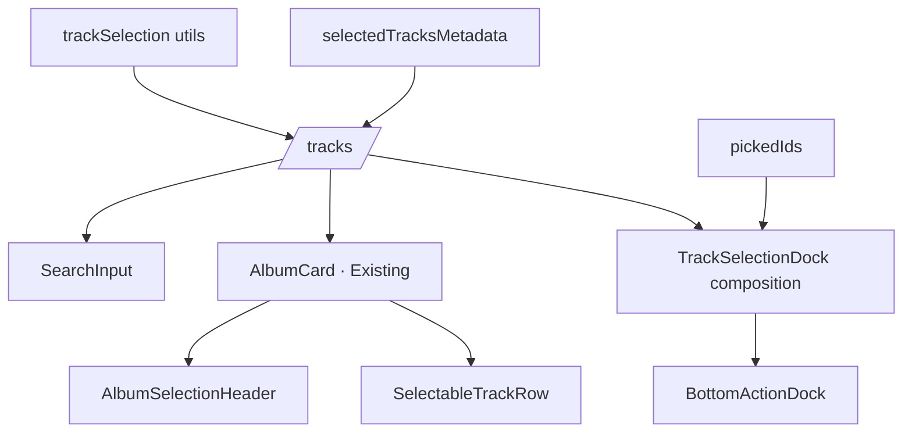

페이지는 **selected를 전달**하고, selected가 어떻게 보이는지는 컴포넌트가 결정한다.

```tsx
<SelectableTrackRow
  track={track}
  selected={selected}
  media={showCover}
  onToggle={() => toggleTrack(track.id)}
/>
```

---

# 7. 같이 소트 만들기 `/together/new`

이 화면은 디자인시스템 이관 효과가 가장 큰 곳 중 하나다.

현재 이미 `AlbumCard`와 `useAlbumAccordion`은 `/tracks`와 공유하지만, 아티스트 선택·곡 선택 표면은 다시 구현돼 있다.

## 이관 후

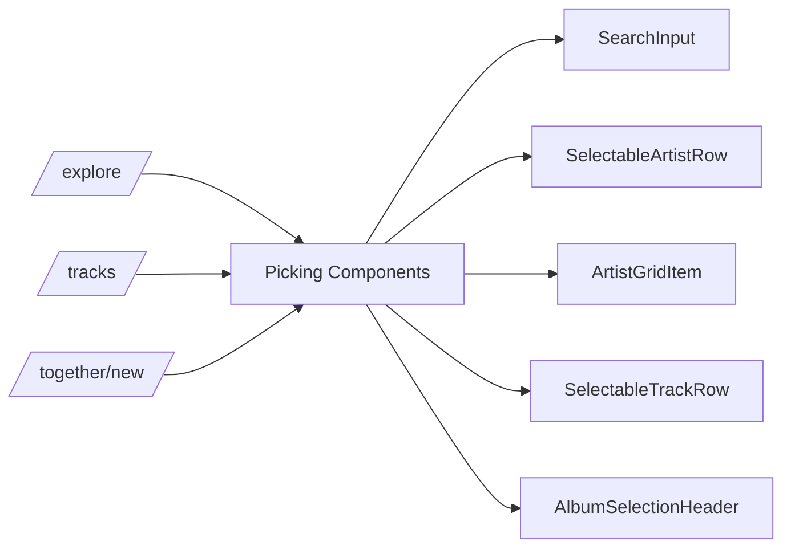

즉 **최애곡 소트와 같이 소트의 앞 절반이 정말 같은 UI system을 사용**하게 된다.

모드 차이는 UI가 아니라:

- source
- 선택 최소 수
- CTA copy
- 다음 route
- 방 생성 로직

에만 남는다.

---

# 8. 월드컵 `/worldcup`

## 현재

이미 핵심 제품 컴포넌트는 있다.

- `WorldCupCandidate`
- `LPPlayer`
- `WinnerReveal`

하지만 주변 UI가 페이지 내부에 있다.

- match count
- progress bar
- round title
- skip hint
- turntable hint
- pendingRemoval undo 영역
- candidate pair 배치

## 이관 후

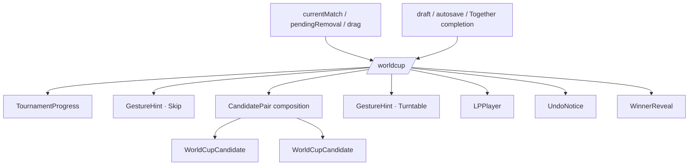

## 절대 바꾸지 않는 것

`WorldCupCandidate`와 `LPPlayer`는 Figma를 기준으로 새로 재구현하는 대상이 아니다.

Figma의 Existing 컴포넌트는 **현재 코드 UI를 정확히 기록하기 위해 만든 것**이다.

따라서 유지:

- press / drag behavior
- drag threshold
- LP reveal
- sleeve 이동·축소·회전
- picture disc
- tonearm geometry
- playback interaction
- reduced motion
- autosave
- completion 기록

바뀌는 것은 **주변 중복 UI의 컴포넌트화**다.

---

# 9. 내 취향 스페이스 `/explore-taste`

현재 이 화면은 이미 `SpaceUI.tsx`를 많이 활용한다.

- UnderlineTabs
- Switch
- RankList
- Cover
- Avatar
- Sheet
- Toast

하지만 실제 목록 Row는 목적별로 다시 조립된다.

## 이관 후

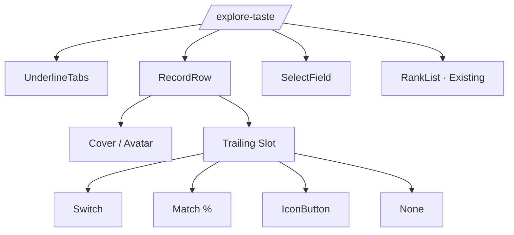

다음이 모두 같은 `RecordRow` anatomy가 된다.

- 개인 취향표
- 같이 소트한 방
- 들어볼 곡
- 취향 싱크 메이트

차이는 Cover vs Avatar, title/meta, trailing slot뿐이다.

---

# 10. 우리의 취향 아카이브 `/archive`

## 공개 취향표

기존 Public result row → `RecordRow`

따라서 My Space와 Archive가 같은 record grammar를 사용한다.

## 미발매곡

여기는 반대로 통합하지 않는다.

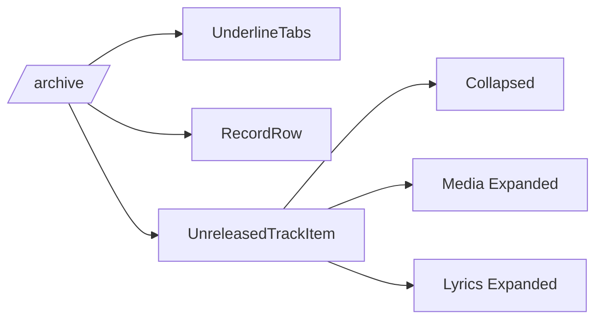

미발매곡은 들어보기·영상 확장·가사 확장·발매 제보가 한 항목 안에서 움직이므로 `RecordRow`로 단순화하지 않는다.

---

# 11. 공개 취향표 상세 `/taste/[id]`

현재 코드에는 이미 rotating disc, 176px sleeve, winner metadata, RankList, CTA 3개가 직접 배치돼 있다.

이관 후:

```text
WinnerFeature
  ├─ LP
  ├─ sleeve
  └─ winner metadata

RankList

Action composition
  ├─ 나도 취향표 만들기
  ├─ 이 곡들로 같이 소트하기
  └─ 우리의 취향 아카이브 보기
```

`WinnerFeature`는 일반 Card가 아니라 **공개 취향표 상세 전용 Product Component**다.

---

# 12. Together 첫 화면 `/together`

현재는 56px 코드 input markup을 페이지가 직접 소유하고, primary/secondary button class는 SpaceUI에서 사용한다.

이관 후:

```tsx
<CodeInput
  value={code}
  onChange={setCode}
  onEnter={enter}
/>

<Button variant="primary">들어가기</Button>
<Button variant="secondary">새로 만들기</Button>
```

페이지에 남는 것:

- 코드 normalize
- challenge lookup
- busy state
- Toast
- router 이동

---

# 13. Together 방 생성 완료

현재 `madeCode`가 생기면 결과 영역이 페이지 markup으로 만들어진다.

이관 후 중심 object는:

```text
RoomCodeCard
  ├─ label
  ├─ large tracked code
  └─ helper

Actions
  ├─ 링크 보내기
  ├─ 링크 복사
  └─ 나도 소트
```

Invite Sheet에서도 같은 `RoomCodeCard`를 Compact density로 재사용할 수 있다.

---

# 14. Together 초대 화면 `/together/[code]`

현재 코드에는 이미 320px hero, image→app-bg gradient, BackButton overlay, 초대 title/desc, 참가 완료자 이름 pill, RankList, fixed bottom CTA가 있다.

이관 후:

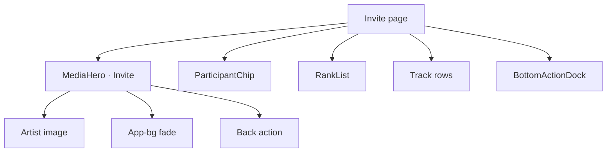

현재 초대 화면의 참가자 pill class는 더 이상 화면에 직접 남지 않고 `ParticipantChip`이 된다.

---

# 15. Together 결과 `/together/[code]/result`

현재 코드에서 이미 중요한 제품 로직은 잘 분리돼 있다.

KEEP:

- `TasteRelationGraph`
- `ParticipantSheet`
- `TogetherPairDetail`

이관 대상은 그 주변 shell이다.

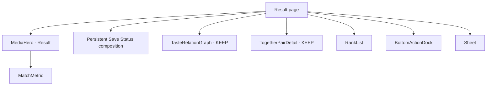

관계 계산이나 PairDetail은 건드리지 않는다.

바뀌는 것은:

- hero 중복 markup 제거
- 큰 일치율의 표현 규칙 고정
- fixed bottom button bar 공통화
- share/invite action hierarchy 통일

---

# 16. Bottom Dock 구조 변화

현재 `BottomDock.tsx`는 **고정 바의 높이를 측정하는 역할**을 잘 수행하고 있다. 이건 버리지 않는다.

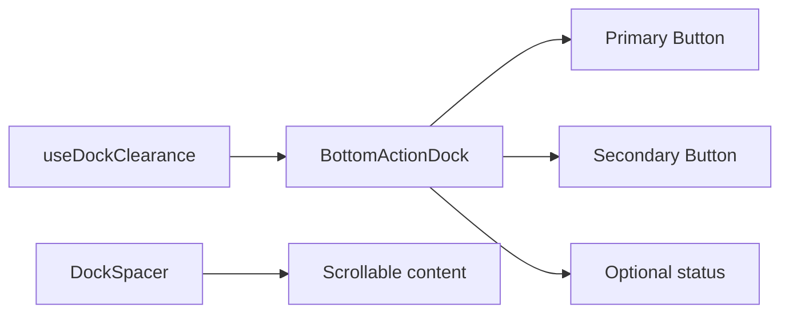

권장 구조:

```tsx
const dockRef = useDockClearance();

return (
  <>
    <main>
      ...
      <DockSpacer />
    </main>

    <BottomActionDock
      ref={dockRef}
      status={status}
      primary={primaryAction}
      secondary={secondaryAction}
    />
  </>
);
```

기존의 **실제 높이 측정 / Toss safe-area 대응 로직은 그대로 유지**하면서, 버튼 바의 시각 구조만 공용화한다.

---

# 17. CSS는 어떻게 바뀌는가

## 1차 이관에서는 globals.css를 크게 쪼개지 않는다

현재 이미 다음 자산이 있다.

- semantic color variables
- `type-*` typography utilities
- app background
- LPPlayer 관련 `tt-*` utilities
- Toss safe-area 규칙

이걸 동시에 재배치하면 위험도가 커진다.

### 1차

```text
globals.css
  ├─ 기존 semantic tokens 유지
  ├─ type-* 유지
  ├─ tt-* 유지
  └─ 새 컴포넌트가 기존 token을 소비
```

### 안정화 후 선택적 2차

```text
styles/
  ├─ tokens.css
  ├─ typography.css
  └─ product-effects.css
```

로 분리할 수 있다. 하지만 이는 디자인시스템 적용의 필수 조건이 아니다.

---

# 18. 컴포넌트 API가 생기면 페이지 코드는 어떻게 달라지는가

## Before

페이지가 직접 selected 상태에 따라 border/background/text class를 갈라 쓴다.

## After

```tsx
<SelectableArtistRow
  artist={artist}
  selected={selected}
  onSelect={handleSelect}
/>
```

결과:

- 긴 className branch 감소
- 동일 역할의 CSS 중복 감소
- selected visual 규칙 한 곳으로 이동
- accessibility 속성도 한 곳에서 관리

---

# 19. 상태 책임은 어디에 남는가

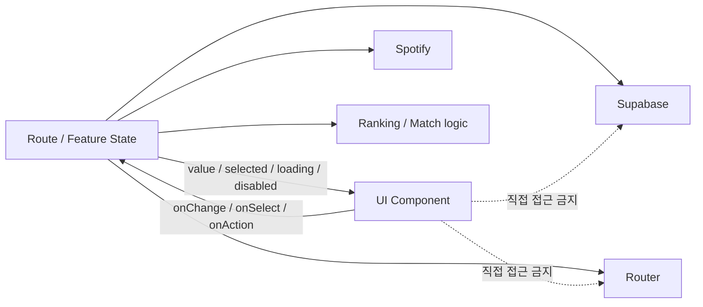

UI 컴포넌트가 알아도 되는 것:

- selected
- loading
- disabled
- error
- label
- image
- metadata
- click handler

UI 컴포넌트가 몰라야 하는 것:

- Supabase table
- draft id
- challenge id 저장 방식
- Spotify 호출
- OAuth
- matchRate
- completion claim
- routing 정책

---

# 20. 실제 파일 영향도

## 새로 생길 가능성이 높은 파일

```text
src/components/ui/
src/components/picking/
src/components/tournament/
src/components/records/
```

Together 기존 폴더에는:

```text
CodeInput.tsx
RoomCodeCard.tsx
ParticipantChip.tsx
MediaHero.tsx
MatchMetric.tsx
```

추가가 예상된다.

## 주로 수정될 Route

```text
src/app/explore/page.tsx
src/app/tracks/page.tsx
src/app/worldcup/page.tsx
src/app/explore-taste/page.tsx
src/app/archive/page.tsx
src/app/taste/[id]/page.tsx
src/app/together/page.tsx
src/app/together/new/page.tsx
src/app/together/[code]/page.tsx
src/app/together/[code]/result/page.tsx
```

## 동작 변경 없이 유지할 핵심 파일

```text
src/components/WorldCupCandidate.tsx
src/components/LPPlayer.tsx
src/components/result/WinnerReveal.tsx
src/components/album/AlbumCard.tsx
src/components/together/TasteRelationGraph.tsx
src/components/together/ParticipantSheet.tsx
src/components/together/TogetherPairDetail.tsx
```

이 파일들은 필요하면 **스타일 소비 방식만 최소 수정**하고 동작 로직은 유지한다.

---

# 21. Before → After 전체 화면 구조

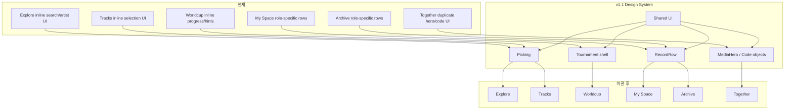

---

# 22. 코드량 관점에서의 변화

## 줄어드는 것

- 같은 Tailwind class 묶음 반복
- selected/unselected 시각 branch
- 검색창 아이콘/clear/focus 반복
- fixed bottom dock markup
- 동일한 Row anatomy
- Together Invite/Result hero 반복

## 늘어나는 것

초기에는 컴포넌트 파일 자체가 생기므로 파일 수는 늘어난다.

하지만 **screen-level UI code가 줄고**, 이후 변경 비용이 낮아진다.

예:

> “선택된 곡 Chip을 조금 더 작게 바꾸자”

현재는 여러 화면을 찾아야 하지만, 이관 후에는 `Chip / SelectableTrackRow` 한 곳을 수정하면 된다.

---

# 23. 이관 완료 후 변경이 쉬워지는 예

## SearchInput

한 번 수정하면:

- 최애곡 아티스트 검색
- 최애곡 곡 검색
- 같이 소트 아티스트 검색

에 동일 규칙 적용.

## RecordRow

한 번 수정하면:

- 내 취향표
- 같이 소트 방
- 들어볼 곡
- 취향 메이트
- 공개 취향표

의 기본 행 spacing/type hierarchy가 함께 바뀐다.

## MediaHero

한 번 수정하면:

- 같이 소트 초대
- 같이 소트 결과

가 함께 바뀐다.

---

# 24. 반대로 한 번에 같이 바꾸면 안 되는 것

디자인시스템 이관 PR에서 아래를 섞지 않는다.

- Supabase schema / RPC
- persistence
- Together participant identity
- pending claim
- match calculation
- worldcup autosave
- routing policy
- Spotify API behavior
- draft ownership

즉 **UI 구조 변경과 비즈니스 로직 변경을 같은 diff에 섞지 않는다.**

---

# 25. 권장 이관 순서

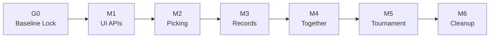

- G0: Together branch와 develop 통합
- M1: UI API만 생성
- M2: `/explore → /together/new → /tracks`
- M3: My Space / Archive / Public Detail
- M4: Together entry / created / invite / result
- M5: Tournament 주변 shell
- M6: 옛 class/compatibility export 제거

---

# 26. 첫 코드 PR에서 실제로 일어날 변화

가장 작은 파일럿:

> **`/explore`의 SearchInput + SelectableArtistRow**

### 새 파일

```text
src/components/ui/SearchInput.tsx
src/components/picking/SelectableArtistRow.tsx
```

### 수정

```text
src/app/explore/page.tsx
```

### 수정하지 않음

- Spotify util
- worldcupDb
- selectedArtists state
- DraftConflict
- auth
- routing

### 검증

- Default
- Filled
- Focus
- Loading
- clear
- selected
- empty result
- mobile width
- keyboard focus
- regression/build/typecheck

이 PR이 통과하면 동일 컴포넌트를 `/together/new`에 적용한다.

---

# 27. 최종 목표

코드 이관이 끝난 뒤 Sortify의 화면은 다음 원칙을 갖게 된다.

> **같은 역할이면 같은 컴포넌트를 쓴다.**  
> **모드가 달라도 역할이 같으면 같은 시각 언어를 쓴다.**  
> **Sortify만의 경험은 억지로 범용화하지 않는다.**  
> **페이지는 UI 모양보다 상태와 흐름을 설명한다.**

새로운 모드나 플로우를 추가할 때도:

```text
기존 Foundations
→ 기존 UI primitives
→ 필요한 Product component
→ 새로운 Composition
```

순서로 만들 수 있고, 화면마다 디자인 규칙을 다시 발명할 필요가 없어진다.

---

# 관련 문서

- [Flow Component Audit](./flow-component-audit.md)
- [Migration Readiness](./migration-readiness.md)
- [Wave A — Picking](./wave-a-picking.md)
- [Wave B — Tournament](./wave-b-tournament.md)
- [Wave C — Records & Archive](./wave-c-records-archive.md)
- [Wave D — Together](./wave-d-together-domain.md)
